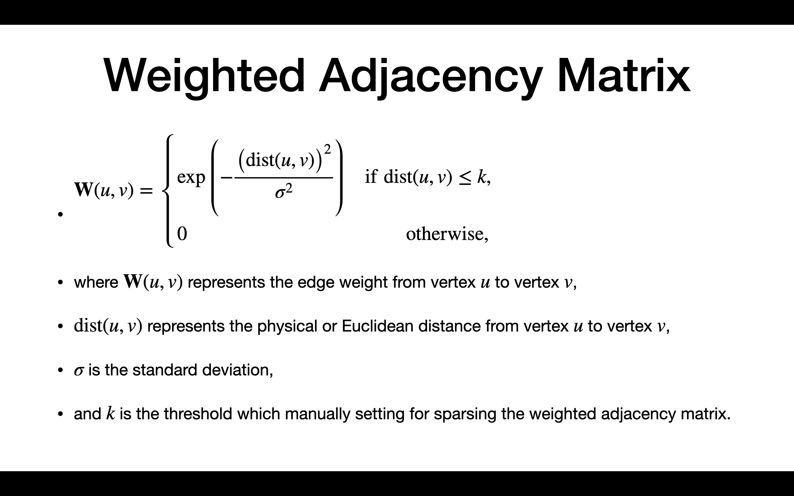
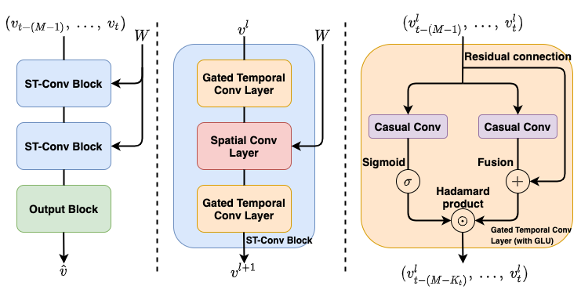

# Spatio-Temporal Graph Convolutional Networks
[](https://github.com/hazdzz/STGCN/issues)
[](https://github.com/hazdzz/STGCN/network/members)
[](https://github.com/hazdzz/STGCN/stargazers)
[](./LICENSE)

## About
The PyTorch version of STGCN implemented for the paper *Spatio-Temporal Graph Convolutional Networks:
A Deep Learning Framework for Traffic Forecasting*.

## Paper
https://arxiv.org/abs/1709.04875

## Related works
1. TCN: [*An Empirical Evaluation of Generic Convolutional and Recurrent Networks for Sequence Modeling*](https://arxiv.org/abs/1803.01271)
2. GLU and GTU: [*Language Modeling with Gated Convolutional Networks*](https://arxiv.org/abs/1612.08083)
3. ChebNet: [*Convolutional Neural Networks on Graphs with Fast Localized Spectral Filtering*](https://arxiv.org/abs/1606.09375)
4. GCN: [*Semi-Supervised Classification with Graph Convolutional Networks*](https://arxiv.org/abs/1609.02907)

## Related code
1. TCN: https://github.com/locuslab/TCN
2. ChebNet: https://github.com/mdeff/cnn_graph
3. GCN: https://github.com/tkipf/pygcn

## Dataset
### Source
1. METR-LA: [DCRNN author's Google Drive](https://drive.google.com/file/d/1pAGRfzMx6K9WWsfDcD1NMbIif0T0saFC/view?usp=sharing)
2. PEMS-BAY: [DCRNN author's Google Drive](https://drive.google.com/file/d/1wD-mHlqAb2mtHOe_68fZvDh1LpDegMMq/view?usp=sharing)
3. PeMSD7(M): [STGCN author's GitHub repository](https://github.com/VeritasYin/STGCN_IJCAI-18/blob/master/data_loader/PeMS-M.zip)

### Preprocessing
Using the formula from [ChebNet](https://arxiv.org/abs/1606.09375)：


## Model structure


## Differents of code between mine and author's
1. Fix bugs 
2. Add Early Stopping approach
3. Add Dropout approach
4. Offer a different set of hyperparameters
5. Offer config files for two different categories graph convolution (ChebyGraphConv and GraphConv)
6. Add datasets METR-LA and PEMS-BAY
7. Adopt a different data preprocessing method

## Requirements
To install requirements:
```console
pip3 install -r requirements.txt
```